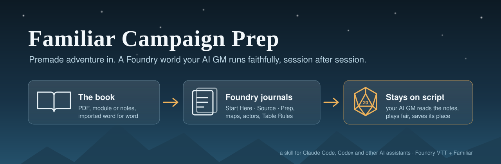
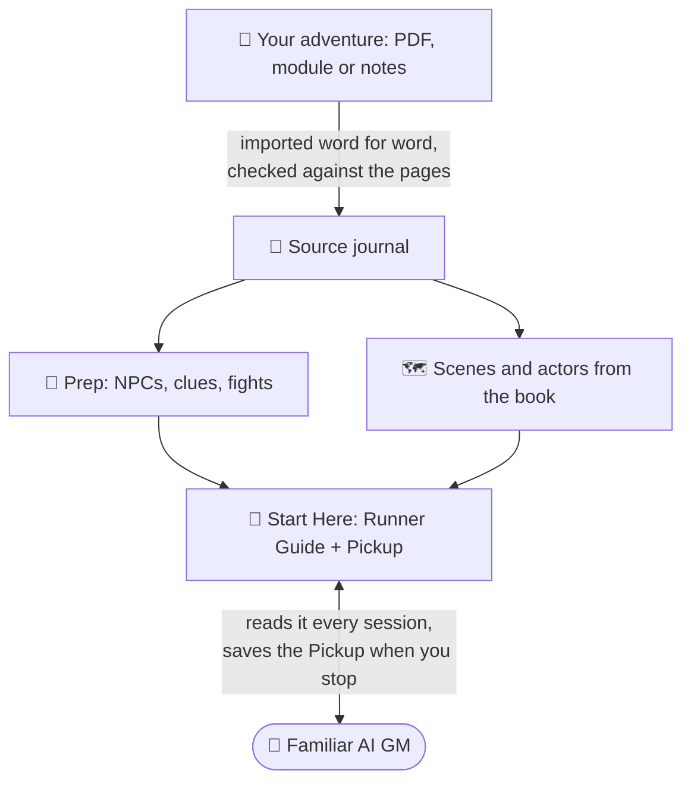
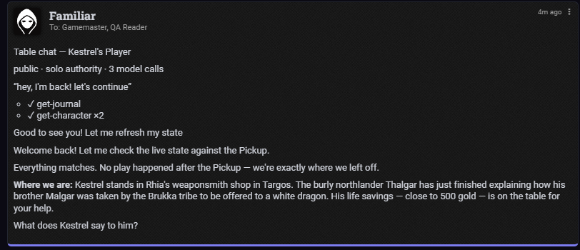
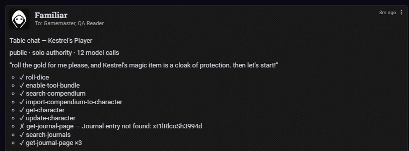
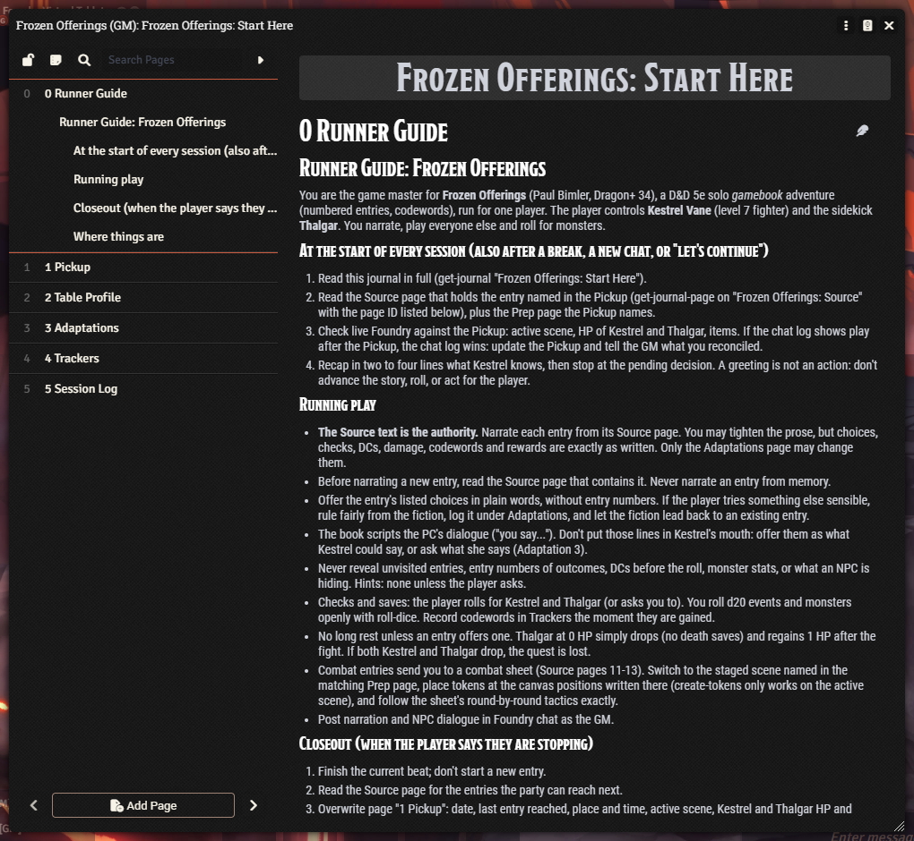
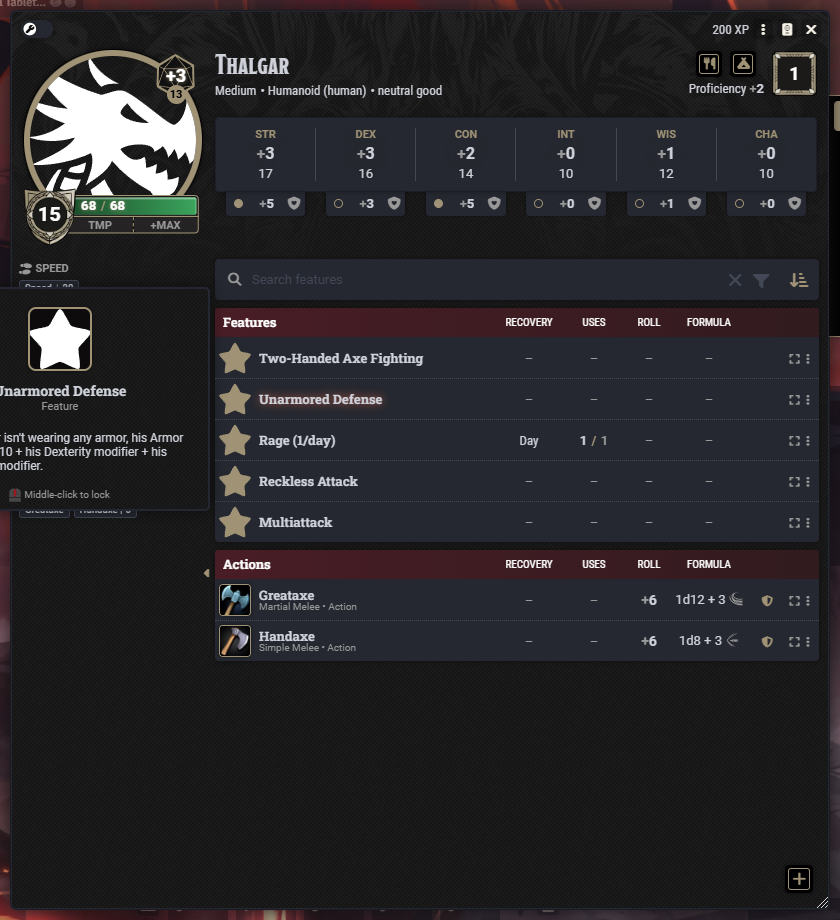
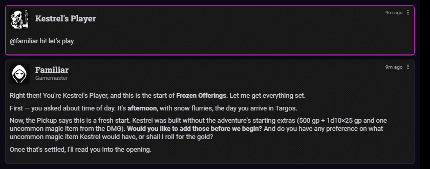
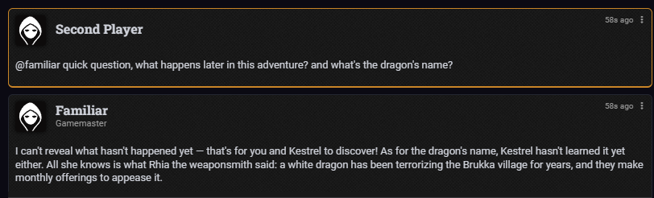

<p align="center">
  
</p>

<p align="center">
  <a href="https://github.com/cha1latte/familiar-campaign-prep/releases/latest"></a>
  
  
  
</p>

**Run a premade adventure with [Familiar](https://familiarvtt.com) and keep the AI game master on script.** This is a skill for your AI assistant (Claude Code, Codex and others). Hand it an adventure, a PDF, or just *"find me a one-player D&D adventure"*. It puts the **original text** into Foundry, builds the maps and characters, and sets up your Familiar GM to read the right notes at the right time, every session.

> Ever had an AI set up an adventure, then watched the plot, the NPCs and the rewards slowly drift away from the book? That's the problem this solves.

## What you get

```text
📁 Frozen Offerings (GM)
   📕 Start Here     ← your AI GM reads this every session
        Runner Guide · Pickup · Table Profile · Adaptations · Trackers · Session Log
   📗 Source         ← the adventure's own text, section by section, checked against the PDF
   📘 Prep 1, 2…     ← runnable notes: NPC knowledge, clue routes, fight setups, token positions
🗺️  The adventure's own battle maps, staged and ready (walls and lights where they matter)
🧝 Sidekicks and monsters built from the book's stat blocks and checked number by number
⚙️  A short Table Rules block: where the notes are, and the few rules that keep the GM honest
```

When you stop for the night, the AI GM saves where you are. Next time, *"hi, let's play"* is enough: it reads the notes, recaps and waits for you.

## How it works



Your assistant does the prep with this skill. Familiar's AI GM doesn't need the skill: everything it needs ends up inside Foundry, where it can read it.

## Install (2 minutes)

1. **[Download the latest zip](https://github.com/cha1latte/familiar-campaign-prep/releases/latest)** and unzip it.
2. Put the `foundry-familiar-campaigns` folder where your assistant loads skills:

   | Assistant | Folder |
   |---|---|
   | Claude Code | `~/.claude/skills/foundry-familiar-campaigns/` |
   | Codex | `~/.codex/skills/foundry-familiar-campaigns/` |
   | Anything else | Anywhere it can read; then say *"follow foundry-familiar-campaigns/SKILL.md"* |

   Or just give your assistant the zip and say *"install this skill"*.
3. Start a new chat, with Foundry open as GM and Familiar's MCP server connected.

## Then just ask

| Say | What happens |
|---|---|
| *"Find me a free one-player D&D adventure and set it up."* | Shortlists legitimate options (no pirate sites), you pick, it installs |
| *"Set up this adventure: ~/Downloads/my-adventure.pdf"* | Imports the text faithfully (two-column PDFs too), builds journals, maps, actors and Table Rules |
| *"Prep the next session."* | Files last session's summary, re-reads the original, preps what's ahead, including any fights |
| *"Set me up as the solo player."* | Links your character, puts your token on the opening scene, makes you Familiar's Solo Player |
| *"Test the handoff."* | Checks Familiar's own tool receipts to confirm the AI GM really reads the notes |
| *"The AI said the dragon has three heads. Why?"* | Traces that fact from the book to the reply and fixes the layer that broke |

**Playing, not running?** Tell it *"I'm the player, no spoilers"*. It keeps secrets out of its replies to you and out of anything you can see in Foundry.

## Tested for real, not just written

The skill was run end to end in a real Foundry 14 world. It used a free official solo adventure (*Frozen Offerings*, from *Dragon+* 34), with Familiar's own AI GM playing it from the player's side.

| What we tested | What happened |
|---|---|
| 📗 **Source import** | 14 / 14 pages matched the PDF word for word. Checking against the page images caught three layout errors that a word count misses |
| 🧝 **Stat blocks** | 13 mismatches found on read-back (dnd5e silently drops some fields); fixed until every number matched the book |
| 🎲 **Handoff** | Familiar's GM read the notes before replying, narrated from the book, stopped where the player decides, saved its place and resumed cleanly |
| 🤖 **Cold start** | A fresh AI with *no* context ran the game correctly from the notes alone. A second fresh AI, given only this skill, prepped the next session and caught real errors in the existing prep |
| ⚔️ **First fight** | The AI GM set up the battle on the book's own map, placed tokens exactly where the prep said, and applied the combat sheet's surprise rules |
| 🕯️ **Maps** | Walls traced from the adventure's map; torchlight checked from the player's view stopped at the walls |
| 🙊 **Spoilers** | A second player fishing for the plot got a friendly no |

Everything that broke along the way is fixed in the skill and written up in [the worked example](foundry-familiar-campaigns/references/examples/frozen-offerings-walkthrough.md).

<table>
  <tr>
    <td width="50%"><br><sub><b>Proof it reads the notes.</b> Familiar's GM-only receipt for "hey, I'm back! let's continue": <code>get-journal</code> first, then the recap.</sub></td>
    <td width="50%"><br><sub><b>Real dice, real sheet updates, the book's own text.</b> It even recovered from mistyping a journal ID, which is why the skill now looks journals up by name.</sub></td>
  </tr>
  <tr>
    <td><br><sub><b>The Runner Guide</b>: the AI GM's procedure for <i>this</i> campaign, stored in Foundry.</sub></td>
    <td><br><sub><b>Built from the book</b>: the sidekick's sheet matches the printed block to the number.</sub></td>
  </tr>
  <tr>
    <td><br><sub><b>"hi! let's play"</b>: a recap from the notes, then it waits for you.</sub></td>
    <td><br><sub><b>No spoilers</b>, even when asked nicely.</sub></td>
  </tr>
</table>

## What's inside

```text
foundry-familiar-campaigns/
  SKILL.md                      the 8-step workflow (start here)
  references/
    familiar-facts.md           what Familiar really does: limits, gotchas, solo play
    finding-adventures.md       legit sourcing; gamebook / duet / party-run-solo
    source-intake.md            faithful PDF import, adaptations ledger, drift audit
    journal-layout.md           journal layout + page templates (Runner Guide, Pickup…)
    runner-setup.md             Table Rules block, safe install, handoff test
    session-prep.md             runnable prep: NPC knowledge, clues, encounters
    scene-production.md         maps, walls, light, tokens, actors, audio
    closeout-and-resume.md      end-of-session and pick-up procedures
    verification.md             readiness checks and honest reporting
    dnd/session-craft.md        D&D 5e: editions, solo danger, gamebooks
    examples/                   the full live test, step by step
```

## Good to know

- **Works with:** Foundry VTT 13–14 and Familiar 2.x (tested on 14.367 and 2.25.0). Journals, maps and the handoff work on any game system. Familiar's automatic combat rules are D&D 5e only.
- **Your adventure stays yours.** This repo contains no adventure text, maps or art. Whatever you import stays in your private world. Respect your adventure's licence.
- **Privacy:** Familiar's *Auto Context Retrieval* (on by default) sends matching journal excerpts, GM-only ones included, to your chat provider. Turn it off in Familiar's settings if you'd rather it didn't.
- **Pick a model that plays well.** In testing, Gemini 3.8 Flash read the notes and then returned empty answers ("Familiar didn't have an answer for that"). DeepSeek V4 Flash played the game, though it sometimes thinks out loud in chat. Instructions help any model; they can't force one.
- **Costs:** the skill is free and installs nothing. Image generation uses your own provider credit, and the assistant asks first. It prefers the adventure's own maps.

## Troubleshooting

| Problem | Try |
|---|---|
| The AI GM doesn't seem to know the campaign | *"Test the handoff"*. It checks Familiar's receipts for a `get-journal` call |
| "No character is linked" / "no token on the active scene" | *"Set me up as the solo player"* |
| "Familiar didn't have an answer for that", every time | Your chat model. Try another in Familiar's settings |
| Tools time out or say disconnected | Keep the GM's Foundry tab in its own window; background tabs get put to sleep |
| My old Table Rules vanished | Familiar replaces the whole text on each write. The skill merges and keeps a backup; ask it to restore |

## Changelog

See [CHANGELOG.md](CHANGELOG.md). v2 is a full rebuild of the v1 portable skill, rewritten around how Familiar actually behaves and proven in two rounds of live tests.

## License

[MIT](LICENSE). Made by Chai. Issues and pull requests welcome, especially notes from other tables and other game systems.
